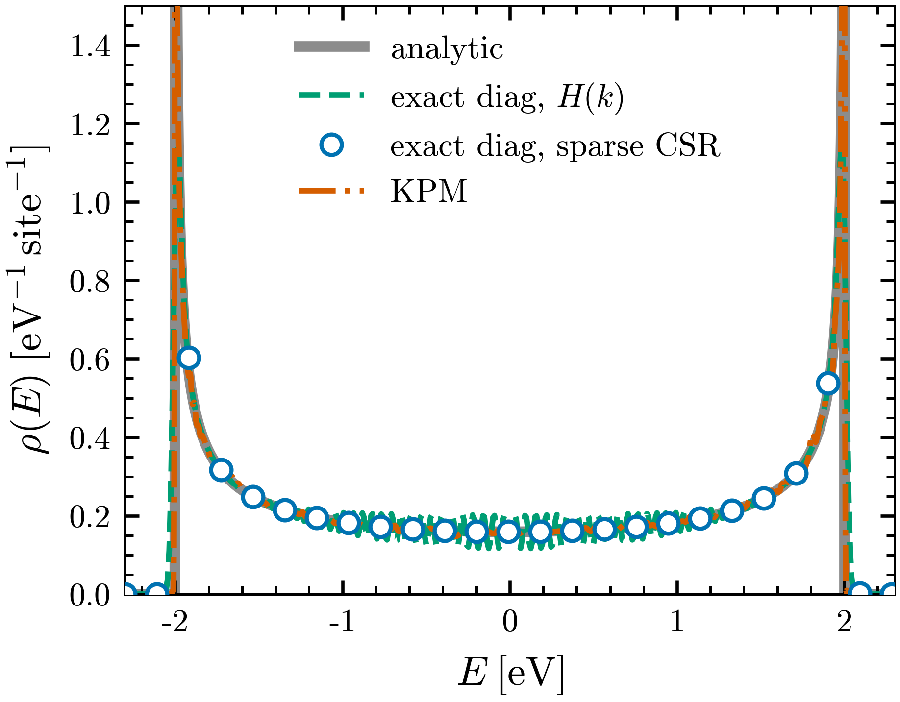

# Tutorial 1: how does a single hopping become a band, and a band a smooth curve?

Take the simplest crystal you can imagine: identical sites on a line, each one
talking only to its two neighbours through a single hopping $t$. There is one
number in the whole model, yet out of it comes a continuous band, and out of the
band a density of states that piles up sharply at the two band edges. A finite
chain has only discrete levels, so where does the smooth curve come from, and how
do we know it is faithful to the model and not to the size of the box we drew it in?

This tutorial answers that for the 1D chain, and in doing so walks the entire
`wannier2sparse` pipeline once, slowly. We start from the primitive real-space
operator $O_{ij}(R)$ that a Wannier90 `_hr.dat` records, expand it into a sparse
supercell matrix, and reconstruct the density of states from that matrix by the
Kernel Polynomial Method. The lesson here is that $O_{ij}(R)$ is the whole model
and the supercell size is the resolution dial on its spectrum.

## The physics

The chain has one orbital per site and a single nearest-neighbour hopping $t$, so
its only non-zero real-space blocks are the on-site term and the two neighbours,

$$ H(R{=}0) = 0, \qquad H(R{=}\pm 1) = t . $$

Bloch's theorem turns these three numbers into a band by summing the real-space
blocks with their phases,

$$ H(k) = \sum_{R} e^{ikR}\, H(R) = t\,(e^{ik} + e^{-ik}) = 2t\cos k . $$

For $t=-1$ the band runs over $E \in [-2, 2]$. The density of states follows from
$\rho(E) = \tfrac{1}{\pi}\,|dk/dE|$, and because $dE/dk = -2t\sin k$ vanishes at
the zone centre and edge, $\rho(E)$ carries the hallmark 1D van Hove signature,

$$ \rho(E) = \frac{1}{\pi\sqrt{4t^2 - E^2}} , $$

an inverse-square-root divergence at each band edge $E = \pm 2|t|$. That closed
form is the thing every later step is checked against.

The conceptual result this tutorial turns on is simpler than the formula: the
three blocks $H(R)$ are the entire model, and nothing the pipeline does adds
physics to them. Expanding to a supercell only chooses how finely $k$ is sampled,
and KPM only chooses how finely $E$ is resolved.


FIG. 1. Density of states $\rho(E)$ of the 1D tight-binding chain. The
characteristic 1D inverse-square-root van Hove divergences sit at the band edges
$E = \pm 2|t|$ and the support is $[-2,2]$ for $t=-1$. KPM reconstruction with
$M = 2048$ Chebyshev moments, $R = 20$ stochastic vectors, Jackson kernel, on a
$400\times1\times1$ supercell.

## Step 1: build the chain as a primitive operator

```bash
bash run.sh chain1d 400       # generates models/tb/chain1d/ (and a first DOS plot)
cd models/tb/chain1d          # the rest of this tutorial runs from here
```

This writes the model in the Wannier90 real-space gauge: a `_hr.dat` holding the
three blocks $H(0)=0$ and $H(\pm 1)=-1$, a `.uc` with the lattice vector, and a
`.xyz` with the single orbital at the origin. Every degeneracy `ndegen` is $1$, so
the numbers are the hoppings themselves with no normalization to undo. The next
step reads these files.

## Step 2: write the input file and run it

A run is described by a small `.w2s` file. Put

```json
{ "label": "chain1d", "mode": "sparse", "supercell": [400, 1, 1] }
```

in `chain1d.w2s` and run it:

```bash
wannier2sparse -x chain1d.w2s        # -> chain1d.HAM.CSR
```

The supercell engine replicates each primitive block $H(R)$ across $N$ cells and
PBC-wraps it, turning the three-number model into one $N\times N$ sparse matrix
whose eigenvalues are $2t\cos k$ sampled at the $N$ allowed momenta $k=2\pi n/N$.

## Step 3: the band structure

The expanded matrix is the band sampled at $N$ momenta, so its sorted spectrum
*is* the dispersion $E(k)=2t\cos k$. The DOS tool
[`w2s_dos.py`](../w2s_dos.py) plots it directly from the CSR:

```bash
python3 ../../../w2s_dos.py chain1d.HAM.CSR --mode spectrum --out chain1d_bands.png
```

The supercell-free route is [`tools/hr_exactdiag.py`](../../tools/hr_exactdiag.py),
which rebuilds $H(k)$ and diagonalizes it on a $k$-path (`hr_exactdiag.py bands
chain1d`); for the chain both trace the same cosine.

## Step 4: the density of states, three exact routes that must agree

Before any approximation the DOS can be computed three independent ways, and they
must land on one curve:

1. the **closed form** $\rho(E)=1/(\pi\sqrt{4t^2-E^2})$;
2. **exact diagonalization of $H(k)$ on the fly**, no supercell, with
   [`tools/hr_exactdiag.py`](../../tools/hr_exactdiag.py);
3. **exact (dense) diagonalization of the expanded sparse supercell matrix**, with
   [`w2s_dos.py`](../w2s_dos.py).

```bash
python3 ../../../../tools/hr_exactdiag.py dos chain1d --emin -2.6 --emax 2.6 --out chain1d_ondemand   # route 2
python3 ../../../w2s_dos.py chain1d.HAM.CSR --mode dos-exact --eta 0.025                               # route 3
```

They coincide (FIG. 2). That is the central check: the supercell engine adds no
physics, the sparse matrix it writes carries the same spectrum as $H(k)$ and as the
closed form.

## Step 5: KPM, and how it tracks exact diagonalization

The Kernel Polynomial Method reconstructs the same $\rho(E)$ from Chebyshev moments
using only sparse matrix-vector products, the operation that scales to the large
supercells transport needs and never diagonalizes anything. A smooth KPM curve
needs a spectrum dense enough that the broadening covers several levels, so first
expand to a larger cell, then let one `compare` command overlay all four routes:

```bash
echo '{ "label": "chain1d", "mode": "sparse", "supercell": [4000, 1, 1] }' > chain1d.w2s
wannier2sparse -x chain1d.w2s            # 4000-site chain1d.HAM.CSR
python3 ../../../w2s_dos.py chain1d.HAM.CSR --mode compare --analytic chain1d \
        --overlay chain1d_ondemand.json --moments 512 --vectors 30 --ymax 1.5 \
        --out ../../../img/chain1d_validation.png
```



FIG. 2. Density of states $\rho(E)$ per site of the 1D chain from four routes that
agree: solid grey, the closed form $\rho=1/(\pi\sqrt{4t^2-E^2})$; dashed green,
exact diagonalization of $H(k)$ on a dense $k$-mesh (no supercell); open blue
circles, exact dense diagonalization of the expanded sparse supercell matrix;
dash-dotted orange, KPM ($M=512$ moments, $R=30$ vectors, Jackson kernel) on that
same matrix. Exact curves use a Gaussian broadening $\eta=0.025$ eV; chain $t=-1$,
band $[-2,2]$, on a $4000\times1\times1$ supercell.

KPM sits on the exact curve: with a large enough cell and enough moments it is
exact up to a controlled broadening. Raise $M$ on too small an $N$ and KPM instead
resolves a comb of individual levels rather than a band, the resolution lesson made
visible: $N$ sets which energies exist, $M$ and the kernel set how sharply each is
drawn.

## Step 6: the same DOS from lsquant

KPM here is a stand-in for the production route. **lsquant** is the linear-scaling
KPM transport code that consumes the `wannier2sparse` CSR directly; running its DOS
on `chain1d.HAM.CSR` reproduces the exact-diagonalization curve above. That is the
end-to-end check that the operator `wannier2sparse` exported is the one the
transport code actually sees. See [lsquant](TODO-LSQUANT-URL).

<!-- TODO[lsquant]: replace TODO-LSQUANT-URL with the lsquant repository/docs link
     (same placeholder as the main README; see documentation_todo.md). -->


## What to take away

- The 1D chain has a single cosine band $E = 2t\cos k$ over $[-2, 2]$ for $t=-1$,
  with inverse-square-root van Hove divergences at both edges.
- The DOS agrees across four routes — closed form, exact diagonalization of $H(k)$,
  exact diagonalization of the sparse supercell matrix, and KPM — so the pipeline
  adds no physics; the sparse matrix carries the same spectrum, and KPM and lsquant
  reproduce it.
- The supercell size $N$ sets the energy sampling and the KPM moment count $M$
  sets the broadening; a smooth, faithful curve needs both.
- A run is one small `.w2s` file, executed with `wannier2sparse -x model.w2s`.

Later tutorials reuse this exact pipeline, primitive $O_{ij}(R)$ to supercell CSR
to KPM density, on models where the band structure is no longer a single cosine.

## References and links

- wannier2sparse source and documentation: https://github.com/adamecius/wannier2sparse
- Operator and gauge conventions: docs/conventions.md and docs/operators.md.
- Wannier functions: N. Marzari et al., Rev. Mod. Phys. 84, 1419 (2012),
  [arXiv:1112.5411](https://arxiv.org/abs/1112.5411). Wannier90: G. Pizzi et al.,
  J. Phys. Condens. Matter 32, 165902 (2020),
  [arXiv:1907.09788](https://arxiv.org/abs/1907.09788).
- Transport methodology: Z. Fan, J. H. Garcia, A. W. Cummings et al., Linear
  scaling quantum transport methodologies, Phys. Rep. 903, 1 (2021),
  [arXiv:1811.07387](https://arxiv.org/abs/1811.07387).
- lsquant, the linear-scaling KPM transport code that consumes the CSR output:
  [lsquant](TODO-LSQUANT-URL).
- The exact-diagonalization and DOS utilities used here:
  [`tools/hr_exactdiag.py`](../../tools/hr_exactdiag.py), [`w2s_dos.py`](../w2s_dos.py).
- Installation: see the main README of the repository.
