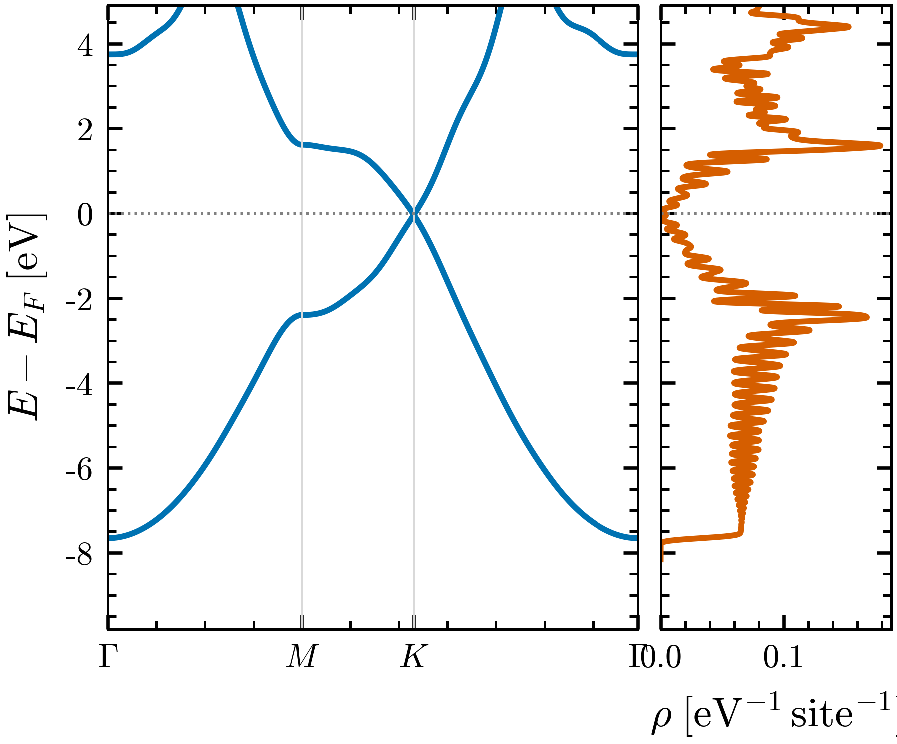

# Tutorial 2: graphene from a real Wannier model — bands and density of states

The 1D chain of tutorial 1 was built by hand from a single number. Graphene is the
opposite: a real material whose model comes out of a first-principles calculation.
Two carbon atoms per cell, one $\pi$ electron each, and out of them two bands that
meet at a single point — the Dirac point — where the density of states drops to
zero. This tutorial takes that model through `wannier2sparse` and shows the band
structure and the density of states side by side, the same Hamiltonian seen two ways.

## The system

Graphene is a honeycomb sheet of carbon. The states near the Fermi level are the two
$\pi$ orbitals, one $p_z$ per atom. Their bonding and antibonding combinations give
two bands that touch at the corner $K$ of the Brillouin zone — the Dirac cone — and
rise to van Hove peaks at the edge midpoint $M$. Everything interesting about
graphene's electrons lives in those two bands.

## Where the model comes from

This is not a toy: the files here are the output of the standard first-principles
chain. A density-functional calculation (Quantum ESPRESSO) gives graphene's bands;
Wannier90 then distils the part that matters into a compact real-space Hamiltonian.
The reasoning is the physics above made literal — there are two $\pi$ bands near the
Fermi level, so the model uses **two Wannier functions, projected onto the carbon
$p_z$ orbitals**. The result is `graphene_hr.dat`, the real-space Hamiltonian
$H(\mathbf{R})$ that reproduces the DFT $\pi$ bands, together with the Wannier90
`.win` that records how it was built and the lattice/position files.

## The one option that matters

A run is one small file, [`graphene.w2s`](graphene.w2s), and the size of the
supercell is the only knob you usually touch — it sets the energy resolution of the
density of states, exactly as in tutorial 1. The single constraint specific to a real
Wannier model is that its hoppings reach far enough that the supercell must be at
least $17\times17$ in plane; smaller and the tool stops you. The Wigner-Seitz
correction that a real model needs is applied automatically — there is nothing to
turn on.

## Run it

```bash
wannier2sparse --provenance graphene
wannier2sparse -x graphene.w2s
python3 ../../tools/hr_exactdiag.py bands graphene --ef -1.7683
python3 ../w2s_dos.py graphene.HAM.CSR --mode dos-exact
```



FIG. 1. Band structure and density of states of the DFT-derived Wannier graphene
model (two $p_z$ Wannier functions), referenced to the Fermi level. Left (solid
blue): the two $\pi$ bands $E(\mathbf{k})$ along $\Gamma$–$M$–$K$–$\Gamma$, touching
at the Dirac point $K$ on $E_F$. Right (solid orange): the density of states
$\rho(E)$ per site; the Dirac dip lines up with the band touching and the van Hove
peaks sit at the $M$-point saddles. The bands come from the Wannier $H(\mathbf{k})$
along the high-symmetry path; the DOS from the expanded $60\times60\times1$ supercell
($\eta = 0.05$ eV broadening).

The two panels are the same model. The bands say *where* the states are in momentum
and energy; the density of states counts *how many* sit at each energy. They share
the vertical axis, so the Dirac point on $E_F$ and the dip in $\rho(E)$ are the same
fact, and the van Hove peaks are the flat parts of the bands near $M$.

## What to take away

- Graphene's two $\pi$ bands touch at the Dirac point $K$ on the Fermi level, where
  the density of states vanishes; van Hove peaks sit at the $M$ saddles.
- The model is a real DFT $\to$ Wannier object: two $p_z$ Wannier functions reproduce
  the first-principles $\pi$ bands, in one compact $H(\mathbf{R})$.
- `wannier2sparse` expands that $H(\mathbf{R})$, and the band structure and the
  density of states it yields are two views of the same Hamiltonian that line up.

The next tutorial moves to three dimensions, where the supercell is small and the
density of states is read against the same kind of exact reference.

## References and links

- Graphene electronic properties: A. H. Castro Neto et al., Rev. Mod. Phys. 81,
  109 (2009), [arXiv:0709.1163](https://arxiv.org/abs/0709.1163).
- wannier2sparse source and documentation: https://github.com/adamecius/wannier2sparse
- Wannier functions: N. Marzari et al., Rev. Mod. Phys. 84, 1419 (2012),
  [arXiv:1112.5411](https://arxiv.org/abs/1112.5411); Wannier90: G. Pizzi et al.,
  J. Phys. Condens. Matter 32, 165902 (2020),
  [arXiv:1907.09788](https://arxiv.org/abs/1907.09788).
</content>
