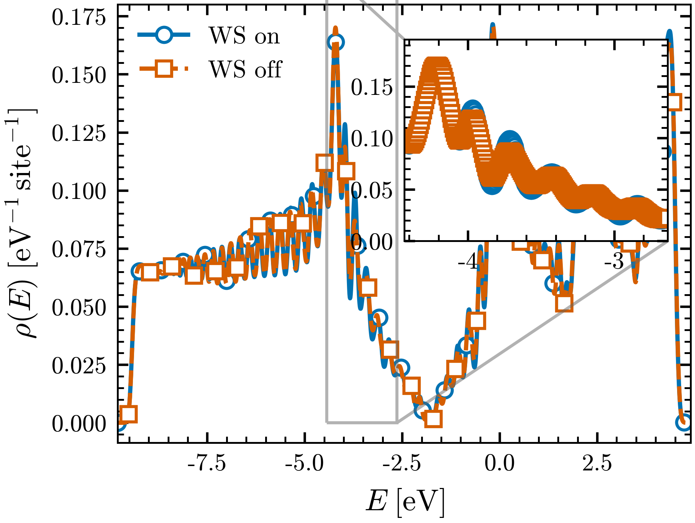
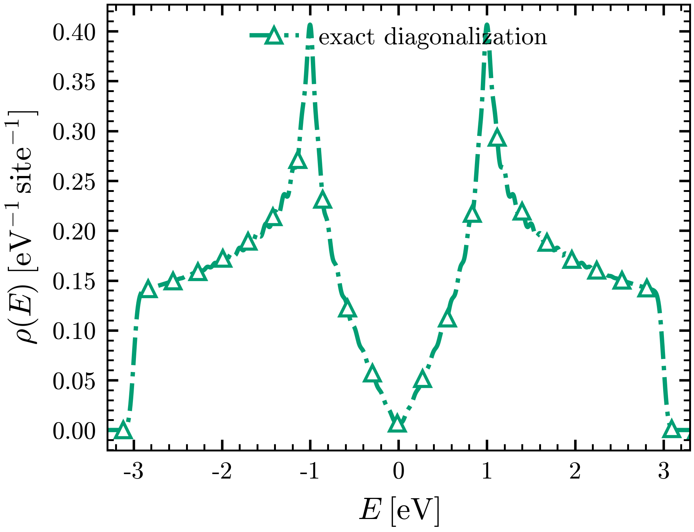

# Tutorial 2: what is the minimal input for a real Wannier calculation?

Tutorial 1 built a chain by hand: a single `_hr.dat` with every Wigner-Seitz
degeneracy `ndegen = 1`, the hoppings written in by fiat. A real model from density
functional theory plus Wannier90 is not like that. Its `_hr.dat` carries genuine
Wigner-Seitz degeneracies (`ndegen > 1`), and Wannier90 ships a companion
`_wsvec.dat` recording the minimum-image lattice vectors. This tutorial answers a
single practical question: **what is the smallest set of files needed to take a real
Wannier90 model to a density of states, and how does that set differ from the
tight-binding minimum of tutorial 1?**

The model is honeycomb graphene, but now from an actual Wannier90 run — the files in
this directory are real Wannier90 output, not a hand-written toy. The lesson is that
the minimal Wannier input is exactly the tight-binding minimum *plus one file*, the
Wigner-Seitz `_wsvec.dat`, which the tool applies automatically to produce the
operator downstream code expects.

## The minimal Wannier input

These files are committed here. Only the first two are needed for a density of
states; the rest are provenance Wannier90 emits and the tool ignores for a DOS:

| File | Needed for a DOS? | What it holds |
|------|-------------------|---------------|
| [`graphene_hr.dat`](graphene_hr.dat) | **yes** | the real-space Hamiltonian $H(\mathbf{R})$ — 2 Wannier functions, 149 $\mathbf{R}$-points, **genuine `ndegen` up to 2** (the Wigner-Seitz degeneracies a DFT model carries). |
| [`graphene.w2s`](graphene.w2s) | yes | the run description (label, `sparse` mode, supercell size) — input, not model data. |
| [`graphene_wsvec.dat`](graphene_wsvec.dat) | **yes (correctness)** | the Wigner-Seitz minimum-image vectors (`use_ws_distance=.true.`). The tool **auto-detects** it from its name and folds the minimum-image correction into every operator. This is the one file a Wannier calculation adds over a tight-binding one. |
| [`graphene.uc`](graphene.uc) | only for geometry | the lattice vectors; read only when an operator needs positions (velocity, $L$). A plain Hamiltonian DOS ignores it. |
| [`graphene.xyz`](graphene.xyz) | only for geometry | the two Wannier centres; same — position-dependent operators only. |
| `graphene.win`, `graphene.wout`, `graphene.eig`, `graphene_centres.xyz`, `graphene_band.*` | no | the Wannier90 run that produced the model: input, log, eigenvalues, centres, interpolated bands. Provenance, not DOS input. |

So the **minimal Wannier set for a DOS is `graphene_hr.dat` + `graphene_wsvec.dat`**
plus a run specification — verified: the tool runs on those two files alone, with no
`.uc`/`.xyz` and no warnings. Set against tutorial 1's tight-binding minimum (a lone
`_hr.dat`), a real Wannier calculation adds exactly the Wigner-Seitz file.

> A larger supercell guard applies here. The Wannier $H(\mathbf{R})$ reaches
> $\lvert\mathbf{R}\rvert = 8$ in-plane, so the minimum-image guard requires
> $N \ge 2\,\mathrm{range}+1 = 17$ per in-plane axis; smaller cells would alias
> distinct bonds and the tool refuses them. The idealized tight-binding model of
> Section 2 has range 1, so any $N$ works there.

## Section 1: the density of states of the minimal Wannier model

A committed [`graphene.w2s`](graphene.w2s) describes the run (a $60\times60\times1$
supercell); the Wigner-Seitz correction is applied automatically because
`graphene_wsvec.dat` is present:

```bash
wannier2sparse -x graphene.w2s        # logs "applying Wigner-Seitz correction" -> graphene.HAM.CSR
```

Reconstruct the DOS from the CSR, once with the `_wsvec.dat` present and once with it
withheld, to see what the Wigner-Seitz file actually does. The figure script does
both runs and the diagonalization:

```bash
python3 make_min_figs.py              # writes ../img/graphene_wannier_dos.png (and the TB panel below)
```



FIG. 1. Density of states $\rho(E)$ per site of the real DFT-derived Wannier graphene
model (two Wannier functions, 149 $\mathbf{R}$-points, Wigner-Seitz degeneracies
`ndegen` up to 2). Solid blue with open circles (WS on): the minimum-image correction
from `graphene_wsvec.dat` applied — the correct minimal-Wannier result. Dashed orange
with open squares (WS off): the same `graphene_hr.dat` with the `_wsvec.dat` withheld.
The two curves nearly coincide; the inset zooms on the window of largest difference
(near $E = -3.5$ eV), where they part by at most $\sim 0.004\ \mathrm{eV}^{-1}\,
\mathrm{site}^{-1}$, within the finite-size ripple of the cell. Both curves are dense
diagonalizations of the expanded supercell Hamiltonian, Gaussian-broadened with
$\eta = 0.06$ eV, on a $60\times60\times1$ supercell (7200 states); energies are
absolute DFT eigenvalues in eV.

For this well-localized graphene model the Wigner-Seitz correction is a *small*
perturbation on the integrated DOS — the two curves overlap within the finite-size
ripple. That is the honest result, and it is worth stating plainly: the correction's
real weight is on $\mathbf{k}$-resolved quantities (the interpolated band structure),
not on the DOS. The file-set takeaway is independent of size: the tool applies the
correction automatically whenever `_wsvec.dat` is present, so a real Wannier DOS is
reproduced from `_hr.dat` + `_wsvec.dat`, and the corrected operator — not the raw
`_hr.dat` — is what downstream transport code expects.

## Section 2: the same lattice as a minimal tight-binding model

The honeycomb lattice also has a textbook two-band tight-binding description: one
$p_z$ orbital per sublattice, a single nearest-neighbour hopping $t = -1$, no
long-range tails, every `ndegen = 1`, and no Wigner-Seitz file at all. That is the
minimal tight-binding input of tutorial 1, applied to graphene — committed here as a
separate seed (`graphene_tb_hr.dat`, with [`graphene_tb.w2s`](graphene_tb.w2s)) so the
two file sets sit side by side. `graphene_tb_hr.dat` is the only file this DOS needs;
`graphene_tb.uc`/`.xyz` are present only for completeness, no operator here uses them,
and there is no `_wsvec.dat`:

```bash
wannier2sparse -x graphene_tb.w2s     # -> graphene_tb.HAM.CSR
# the tight-binding panel is produced by the same make_min_figs.py call as Section 1
```



FIG. 2. Density of states $\rho(E)$ per site of the idealized two-band tight-binding
graphene (`graphene_tb_hr.dat` only: nearest-neighbour $t = -1$, every `ndegen = 1`,
no `_wsvec.dat`). Dash-dotted green with open triangles: dense diagonalization of the
expanded supercell Hamiltonian, Gaussian-broadened with $\eta = 0.04$. $\rho(E)$
vanishes linearly at the Dirac point $E = 0$, with van Hove peaks at $E = \pm\lvert
t\rvert$ and band edges $\pm 3\lvert t\rvert$, on a $60\times60\times1$ supercell
(7200 states). Energies in units of $\lvert t\rvert$ (eV).

The two figures are the same lattice through two different file sets. The Wannier
model (FIG. 1) is a real DFT object: long-range hoppings, on-site energies at the DFT
Fermi level, and a Wigner-Seitz file that the minimal set cannot drop. The
tight-binding model (FIG. 2) is the analytic idealization: a single $_hr.dat$ with
three numbers' worth of physics, the Dirac dip and van Hove peaks landing exactly
where the closed form predicts.

## What to take away

- The **minimal input for a real Wannier DOS is `_hr.dat` + `_wsvec.dat`** plus a run
  specification; `.uc`/`.xyz` are required only for position-dependent operators, and
  the rest of the Wannier90 output is provenance the DOS does not need.
- The **minimal tight-binding input is a single `_hr.dat`** (tutorial 1). A real
  Wannier calculation differs by exactly one file, the Wigner-Seitz `_wsvec.dat`,
  auto-detected and folded into every operator.
- The `_wsvec.dat` is part of the minimal set because the tool applies it
  automatically and the corrected operator is the intended one. Its effect on the
  *DOS* of this well-localized model is small (FIG. 1, the curves overlap within the
  finite-size ripple); it weighs much more on the interpolated band structure and
  other $\mathbf{k}$-resolved quantities.
- Both file sets run through the identical engine — replicate $H(\mathbf{R})$ across
  the supercell, PBC-wrap, write a sparse CSR — and the supercell-size and KPM
  resolution dials of tutorial 1 carry over unchanged.

## References and links

- Graphene electronic properties: A. H. Castro Neto et al., Rev. Mod. Phys. 81,
  109 (2009), [arXiv:0709.1163](https://arxiv.org/abs/0709.1163).
- wannier2sparse source and documentation: https://github.com/adamecius/wannier2sparse
- The `.w2s` input file and the file set each operator needs: [docs/input_file.md](../../docs/input_file.md).
- Operator and gauge conventions, including the Wigner-Seitz minimum image:
  [docs/conventions.md](../../docs/conventions.md) and [docs/operators.md](../../docs/operators.md).
- Wannier functions and the Wigner-Seitz interpolation: N. Marzari et al., Rev. Mod.
  Phys. 84, 1419 (2012), [arXiv:1112.5411](https://arxiv.org/abs/1112.5411);
  Wannier90: G. Pizzi et al., J. Phys. Condens. Matter 32, 165902 (2020),
  [arXiv:1907.09788](https://arxiv.org/abs/1907.09788).
</content>
</invoke>
