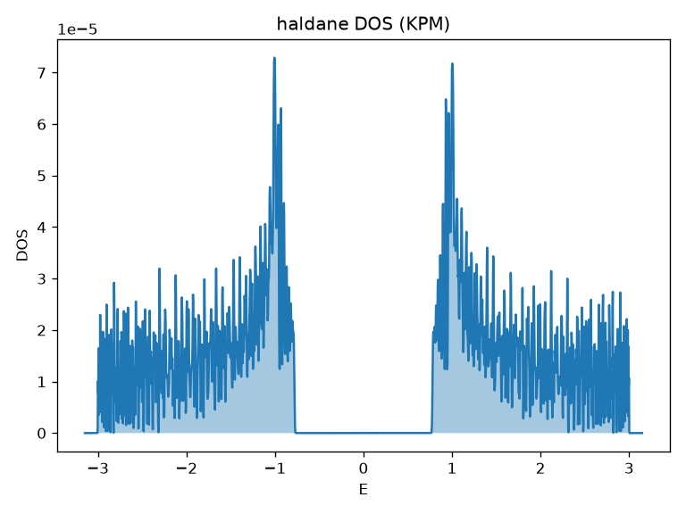
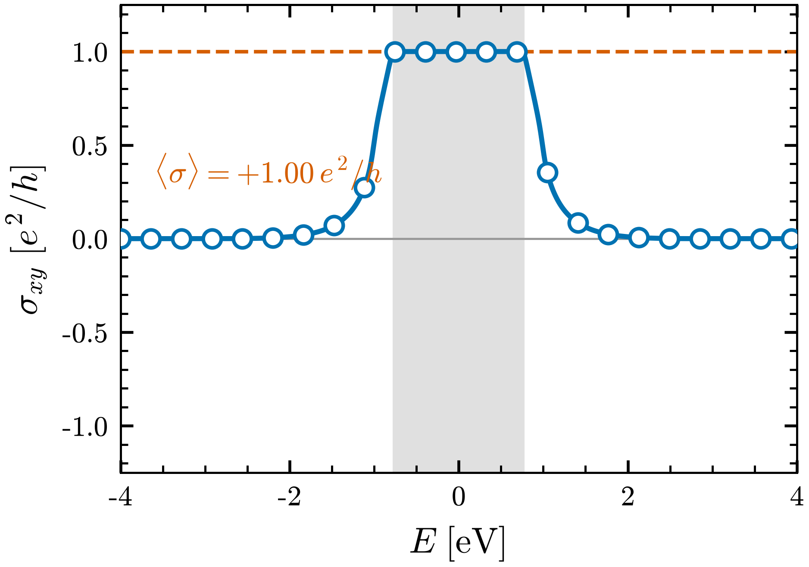

# Tutorial 4: how can a hopping that hides no net flux still open a gap?

Take graphene, with its two carbon sublattices and its bands that meet at a single
point, and add a second hopping that skips to the next-nearest neighbour. If that
hopping is complex, with a phase that circulates one way around each plaquette and
the other way back, it threads no net magnetic flux through the cell, yet the
gapless Dirac point splits open. A real number on the bond could never do this;
the imaginary part can. Where in the model does that gap actually live?

We are after the density of states of the Haldane model, and we want to see the
gap appear at $E=0$ where graphene had only a dip. The single idea this tutorial
teaches is that the same real-space machinery $O_{ij}(\mathbf{R})$ that carried
graphene now carries the ingredients of topology: the imaginary entries of
$H(\mathbf{R})$ are just complex numbers in the same file, the gap is their
visible consequence, and the velocity operator built from $H(\mathbf{R})$ is what
later feeds Berry-curvature and Hall responses. The lesson here is that complex
hoppings need no new pipeline, they are ordinary entries in the operator we have
been expanding all along.

## The physics

The Haldane model is graphene plus a complex next-nearest-neighbour hopping. The
Bloch Hamiltonian is the same forward transform as before,

$$ H(\mathbf{k}) = \sum_{\mathbf{R}} e^{i\mathbf{k}\cdot\mathbf{R}}\, H(\mathbf{R}), $$

but now $H(\mathbf{R})$ has on-sublattice terms at the next-nearest-neighbour
cells with amplitude $t_2 e^{\pm i\phi}$, with $+\phi$ for one sublattice and
$-\phi$ for the other. The nearest-neighbour part is graphene's, real and
inter-sublattice, with $t_1=-1$. With $t_2=0.15$ and $\phi=\pi/2$, the complex
term gaps both Dirac points and the spectral density opens a window around zero,

$$ E_g \approx 3\sqrt{3}\,t_2 \approx 0.78. $$

The conceptual result is this: the gap is not put in by hand as a sublattice mass,
it is generated by the phase of an off-diagonal-in-cell, diagonal-in-sublattice
hopping. Because that hopping lives in $H(\mathbf{R})$ exactly like every real
hopping, the velocity operator $v_a$ built from it inherits the same phase, and it
is those phase-carrying matrix elements that produce a Berry curvature. That
Berry curvature integrates to a non-zero Chern number, and Step 4 reads it off as
a quantized Hall plateau; the first deliverable, in the density of states, is the
gap that the complex hopping opens.



FIG. 1. Density of states $\rho(E)$ of the Haldane model (graphene plus a complex
next-nearest-neighbour hopping). The complex hopping opens a gap
$E_g \approx 3\sqrt{3}\,t_2 \approx 0.78$ for $t_2 = 0.15$, $t = -1$, in contrast
to graphene's gapless Dirac dip. KPM reconstruction with $M = 2048$ Chebyshev
moments, $R = 20$ stochastic vectors, Jackson kernel, on an $80\times80\times1$
supercell.

## Step 1: build the Haldane model

```bash
bash run.sh haldane 80         # generates models/tb/haldane/ (and a first DOS plot)
cd models/tb/haldane           # the rest of this tutorial runs from here
```

This writes the same honeycomb lattice as graphene, with the same two sublattices
and the same nearest-neighbour bonds, then adds the complex next-nearest-neighbour
terms $t_2 e^{\pm i\phi}$ as nonzero imaginary parts in `haldane_hr.dat`. The next
step reads these files.

## Step 2: describe the run in an input file, then run it

The operator we expand is $H(\mathbf{R})$ itself, the Haldane Hamiltonian, complex
entries and all. The recommended way to drive the expansion is the input-file
workflow, which records every option in an editable `key = value` file and then
executes it.

```bash
wannier2sparse --create haldane.inp                     # 1. template
wannier2sparse --write label=haldane     -inp haldane.inp   # 2. populate
wannier2sparse --write supercell 80 80 1 -inp haldane.inp
wannier2sparse --run haldane.inp                        # 3. run -> haldane.HAM.CSR
```

This replicates every nonzero $H_{ij}(\mathbf{R})$ across the supercell, PBC-wraps
it, and writes `haldane.HAM.CSR` plus the provenance summary `haldane.w2sp.out`.
The input file is a durable record of the run; prefer it over the older positional
one-liner `wannier2sparse haldane 80 80 1`, which gives byte-identical output.

## Step 3: the complex hopping has opened a gap

The KPM density of states from the CSR shows the gap directly.


The curve falls to zero across a window of width $E_g \approx 0.78$ centred on
$E=0$, where graphene's density of states only dipped linearly to a single point
(Tutorial 2). Same lattice, same nearest-neighbour bonds, same band edges near
$\pm 3$; the only difference is the imaginary part of the second-neighbour hopping,
and that difference is the gap. For the band picture rather than its density, the
exact-diagonalization oracle shows the same gap on a k-path:

```bash
python3 ../../../../tools/hr_exactdiag.py bands haldane
```

## Step 4: the gap is topological — a quantized Hall plateau

The gap is not just any gap. The same exact-diagonalization tool builds the
velocity $v_a = \partial H/\partial k_a$ internally from $H(\mathbf{R})$ and sums
the Berry curvature of the occupied band over the Brillouin zone, giving the
intrinsic anomalous (charge) Hall conductivity in units of $e^2/h$:

$$ \sigma_{xy}(E_F) = \frac{2\pi}{A_{\mathrm{cell}}}\frac{1}{N_k}\sum_{\mathbf{k}}
   \sum_{n:\,E_n<E_F}\Omega_n(\mathbf{k}), \qquad
   \Omega_n = -2\,\mathrm{Im}\!\!\sum_{m\neq n}
   \frac{\langle n|v_x|m\rangle\langle m|v_y|n\rangle}{(E_n-E_m)^2}. $$

```bash
python3 ../../../../tools/hr_exactdiag.py ahc haldane --nk 160 --emin -4 --emax 4 --out haldane_ahc
```

In a gap, this integral is the Chern number, an exact integer. The lower band of
this Haldane model carries $C=+1$, so $\sigma_{xy}$ sits on a perfectly flat
plateau at $+1\,e^2/h$ for every Fermi level inside the gap (the computed plateau
is $+1.0000$ with zero spread), and falls to zero once both bands are filled or
both are empty.



FIG. 2. Intrinsic anomalous Hall conductivity $\sigma_{xy}(E_F)$ of the Haldane
model versus Fermi energy $E$, in units of $e^2/h$. Solid blue with open circles:
exact Berry-curvature sum from `tools/hr_exactdiag.py ahc`; dashed orange: the
quantized value $\langle\sigma_{xy}\rangle = +1.00\,e^2/h$ averaged over the
shaded gap; grey band: the bulk gap $\lvert E\rvert \lesssim 3\sqrt{3}\,t_2/2$.
The curve rises from $0$ below the lower band to the integer plateau $C=+1$ across
the gap and returns to $0$ once both bands are occupied. Parameters $t_1=-1$,
$t_2=0.15$, $\phi=\pi/2$; Berry curvature summed on a $160\times160$ $\mathbf{k}$-mesh
with $20$ meV Gaussian broadening on the Fermi sweep.

The quantization is what "topological" means operationally: the plateau height is
an integer pinned by the global structure of the occupied band, immune to the
exact value of $t_2$ or $\phi$ as long as the gap stays open. The same fingerprint
reappears in Tutorial 9 for a real material: PdSe$_2$ is trivial at its Fermi-level
gap, but a higher, topological gap shows a flat, near-quantized **spin** Hall
plateau at $+0.94\,e^2/h$ — the same integer-step signature, in the spin channel.

## What to take away

- The Haldane model opens a gap $E_g \approx 3\sqrt{3}\,t_2 \approx 0.78$ at
  $E=0$, where graphene's density of states only touched zero at the Dirac point.
- The gap comes from the phase of a complex hopping, not from a sublattice mass;
  the imaginary part of $H(\mathbf{R})$ is what gaps the Dirac points.
- A complex hopping needs no new machinery: it is an ordinary entry in the same
  real-space operator $O_{ij}(\mathbf{R})$ that the tool expands and PBC-wraps.
- The velocity operator built from this $H(\mathbf{R})$ inherits the same phase,
  which is exactly what a Berry-curvature or Hall calculation reads.
- That gap is topological: the occupied band has Chern number $C=+1$, so the
  anomalous Hall conductivity is a quantized plateau at $+1\,e^2/h$ across the
  gap — an exact integer, the signature this model was built to show.

Tutorial 9 (`examples/example_9_SHC_in_PdSe2`) follows that last thread: it builds
the velocity and spin operators from a real spin-orbit model and computes the
intrinsic spin Hall conductivity, where the off-diagonal velocity matrix elements
that this gap hinted at carry the Berry connection.

## References and links

- wannier2sparse source and documentation: https://github.com/adamecius/wannier2sparse
- Operator and gauge conventions: docs/conventions.md and docs/operators.md.
- Wannier functions: N. Marzari et al., Rev. Mod. Phys. 84, 1419 (2012),
  arXiv:1112.5411. Wannier90: G. Pizzi et al., J. Phys. Condens. Matter 32,
  165902 (2020), arXiv:1907.09788.
- Transport methodology: Z. Fan, J. H. Garcia, A. W. Cummings et al., Linear
  scaling quantum transport methodologies, Phys. Rep. 903, 1 (2021),
  arXiv:1811.07387.
- Installation: see the main README of the repository.

## Further reading

- F. D. M. Haldane, Phys. Rev. Lett. 61, 2015 (1988): the model of a quantum Hall
  effect without Landau levels.
