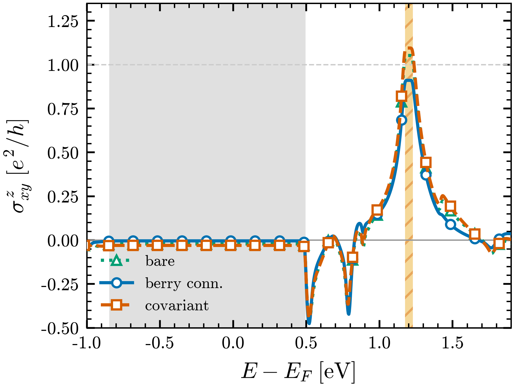
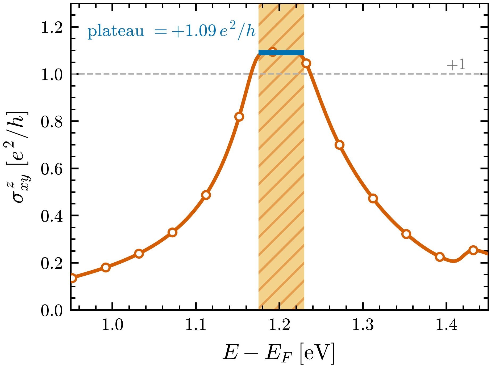

# Tutorial 5: a spin current with no charge current, in a real SOC material

Send an electric field through monolayer PdSe$_2$ and no charge Hall current
flows, the crystal has inversion symmetry. Yet a transverse flow of *spin* is
allowed, and spin-orbit coupling switches it on. How large is it, where in energy
does it live, and how faithfully can we read it off a tight-binding-sized model of
a first-principles material?

We compute the intrinsic spin Hall conductivity $\sigma^{z}_{xy}$ of PdSe$_2$ from
a Wannier model, as the response of the spin current $J^{z}_{x}$ to a field along
$y$. The one lesson that survives into every later use: a transport coefficient is
only ever as good as the *operators* you build, and for an interband quantity like
$\sigma^{z}_{xy}$ the velocity operator must carry the Berry connection, not just
the gradient of the Hamiltonian.

## The physics

A Wannier model is a set of real-space operators $O_{ij}(\mathbf{R})$ between
Wannier function $i$ in the home cell and $j$ in cell $\mathbf{R}$. Every momentum
quantity comes from the same forward transform (see `docs/conventions.md`):

$$ O(\mathbf{k}) = \sum_{\mathbf{R}} e^{+i 2\pi \mathbf{k}\cdot\mathbf{R}}\,
   \frac{O(\mathbf{R})}{n_{\mathrm{deg}}(\mathbf{R})}. $$

We need three operators: the Hamiltonian $H$, the velocity $v_a = \partial H /
\partial k_a$, and the spin $S_z$ (Pauli, units $\hbar/2$). From them the **spin
current** is the symmetrized product

$$ J^{z}_{x} = \tfrac{1}{2}\{\,v_x,\,S_z\,\}, $$

and the intrinsic (Fermi-sea) spin Hall conductivity is the spin-Berry-curvature
sum over occupied states,

$$ \sigma^{z}_{xy}(E_F) = \frac{e}{\hbar}\!\!\sum_{\mathbf{k}}\sum_{n\ \mathrm{occ}}
   \sum_{m\neq n} \frac{2\,\mathrm{Im}\big[\langle n|J^{z}_{x}|m\rangle\langle m|v_y|n\rangle\big]}
   {(E_n-E_m)^2}. $$

The conceptual result this tutorial turns on: that interband sum is sensitive to
the **off-diagonal velocity matrix elements**, and those are wrong unless the
velocity includes the Berry connection $A_a(\mathbf{R})=\langle 0i|r_a|\mathbf{R}j\rangle$
(the inter-Wannier dipoles). The bare $v_a = i(\mathbf{R}\!\cdot\!\mathrm{lat})_a
H(\mathbf{R})$ gets the bands right but the spin Hall wrong.


FIG. 1. Wannier band structure of monolayer PdSe$_2$ (12 spinor Wannier
functions, relativistic PBE + SOC) along $\Gamma$-X-S-Y-$\Gamma$-S, $E$ relative
to $E_F=-1.3162$ eV. A clean gap surrounds $E_F$; the intrinsic $\sigma^{z}_{xy}$
peaks near the conduction-band near-degeneracy at $E-E_F\approx 1.2$ eV.
Reconstructed from `pdse2_proj_hr.dat` by `tools/hr_exactdiag.py bands`.

## Pre-run: from Quantum ESPRESSO to the operators

Nothing bulky is shipped (repo policy): this example commits only the small text
inputs and regenerates everything else with `get_inputs.sh`. The chain is

```bash
# (committed: qe/scf.in qe/nscf.in qe/bands.in  w90/pdse2_proj.win  w90/pw2wan*.in)
bash get_inputs.sh 50          # runs QE -> Wannier90 -> wannier2sparse (N=50 cell)
```

Step by step, and the file each step emits:

1. **SCF + NSCF** (`pw.x`, noncollinear + `lspinorb`, full uniform $4\times4\times1$
   grid). Needs the fully-relativistic Pd, Se PAW pseudopotentials (~9 MB, **not
   committed**, fetch per `get_inputs.sh`).
2. **`wannier90.x -pp`** then **`pw2wannier90.x`** twice: the first writes the
   overlaps/projections/eigenvalues (`.mmn`, `.amn`, `.eig`), the second
   (`pw2wan_spn.in`) writes the spin matrices (`.spn`). `.mmn` (32 MB) and `.spn`
   (3.5 MB) are the large files we deliberately do not ship.
3. **`wannier90.x`** with `write_hr`, `write_xyz`, `write_u_matrices` (and
   `write_rmn` for the covariant velocity) produces `pdse2_proj_hr.dat` (the
   Hamiltonian), `.xyz` (Wannier centres), `_u.mat`, and optionally `_r.dat` (the
   position/Berry-connection matrix).

Which operator needs which file is tabulated in `docs/operators.md`; the short
version is: $H$ and the geometric velocity need only `_hr.dat` + `.xyz` + `.uc`;
exact spin needs `.spn` + `_u.mat`; the covariant velocity needs `_r.dat`.

## Building the operators and the spin current

`wannier2sparse` expands the primitive model into a finite supercell CSR and, in
the same call, builds the velocity, the exact spin, and the spin current. Put

```json
{
  "label": "pdse2_proj", "mode": "sparse", "output_dir": "out",
  "supercell": [50, 50, 1],
  "operators": ["VX", "VY", "VXSZ"],
  "exact_spin": true,
  "velocity_mode": "covariant",
  "r_dat": "pdse2_proj_r.dat"
}
```

in `shc.w2s` and run it:

```bash
wannier2sparse -x shc.w2s
# -> out/pdse2_proj.{HAM,VX,VY,SXexact,SYexact,SZexact,VXSZ}.CSR
```

Here `VXSZ` is the spin current $J^{z}_{x}=\tfrac12\{v_x,S_z\}$. The `velocity_mode`
key chooses the velocity ladder (`bare` | `berry_connection`, default |
`covariant`) and applies it to `VX/VY/VZ` **and** to the velocity inside the spin
current. For the spin Hall, use `covariant`: it reads
the Berry connection $A_a(\mathbf{R})=\langle 0i|r_a|\mathbf{R}j\rangle$ from
Wannier90's `_r.dat` (`write_rmn=.true.`) and forms
$v_a=-i(\mathbf{R}\!\cdot\!\mathrm{lat})_a H - i[H,A_a]$ (the Wang-Yates-Souza-
Vanderbilt covariant velocity). `bare`/`berry_connection` need no `_r.dat` and are
correct for bands, DOS and $\sigma_{xx}$ — the difference shows up only in the
interband (Hall) matrix elements. Pitfall: the `_r.dat` must come from the same
Wannier90 run as `_hr.dat` (same gauge).

The spin current is the lesson of §"physics" made operational. For the diagonal
$\sigma_z$ the anticommutator is local, but for off-diagonal $\sigma_{x,y}$ it
mixes orbitals, so the `VXSZ` operator forms the true matrix anticommutator
$\tfrac12(V S + S V)$ after expansion rather than an element-wise product. A
**tight-binding** user who already has the operators as `_hr.dat` files skips DFT
entirely: drop them in an `operators/` folder (`SZ_hr.dat`, `VXSZ_hr.dat`, …) and
list their names in `operators`, and they are read and expanded by the same engine.

## The velocity ladder, run three ways

The single most important choice for a spin-Hall calculation is *which velocity*.
`wannier2sparse` builds three, in increasing fidelity, and the `velocity_mode` key
governs `VX/VY/VZ` and the velocity inside `J=½{V,S}`. It lives in the same
`shc.w2s` as everything else:

```json
{
  "label": "pdse2_proj", "mode": "sparse", "output_dir": "out",
  "supercell": [50, 50, 1],
  "operators": ["VXSZ"],
  "exact_spin": true,
  "velocity_mode": "covariant",   // <- the ladder rung; bare | berry_connection | covariant
  "r_dat": "pdse2_proj_r.dat"     // needed only for covariant
}
```

Switch `velocity_mode` between the three rungs and recompute the intrinsic
$\sigma^{z}_{xy}$ for each:

- **`bare`** — $v_a=-i(\mathbf{R}\!\cdot\!\mathrm{lat})_a H$. The pure Bloch-phase
  gradient. Needs nothing but `_hr.dat`.
- **`berry_connection`** *(default)* — adds the diagonal Wannier centres from
  `.xyz`, $v_a=-i(\mathbf{R}\!\cdot\!\mathrm{lat}+\Delta r_{ij})_a H$. Equal to
  `bare`$-\,i[H,A_{\mathrm{diag}}]$.
- **`covariant`** — the full Wang-Yates-Souza-Vanderbilt velocity
  $v_a=-i(\mathbf{R}\!\cdot\!\mathrm{lat})_a H-i[H,A_a]$, with the inter-Wannier
  Berry connection $A_a(\mathbf{R})=\langle 0i|r_a|\mathbf{R}j\rangle$ read from
  `_r.dat` (`write_rmn=.true.`). The off-diagonal of $A_a$ is the new physics.



FIG. 2. Intrinsic $\sigma^{z}_{xy}(E_F)$ of monolayer PdSe$_2$ in units of $e^2/h$,
computed from the `wannier2sparse` operators in all three velocity modes. Dotted
green triangles: `bare`; solid blue circles: `berry_connection` (default);
dashed orange squares: `covariant`. Grey band: the trivial Fermi-level gap
($\sigma^{z}_{xy}\approx 0$); orange hatched band: the topological gap at
$E-E_F\approx 1.2$ eV; grey dashed line: $+1\,e^2/h$. All three modes land on the
same near-quantized plateau (bare $+1.05$, berry\_connection $+0.91$, covariant
$+1.09\,e^2/h$; the wannierberri covariant reference gives $+0.94$) — the topology
is robust to the rung, and the $\sim$10% spread is the Berry-connection refinement.
Exact diagonalization on a $300\times300$ k-mesh with $\eta=6$ meV (below the
55 meV gap, so the cumulative sum is *flat* across it — see FIG. 3); $e^2/h$ via
`tools/hr_exactdiag.py shc --shc-units e2h`. $E_F=-1.3162$ eV.

The lesson the figure makes concrete: for *this* gap the three rungs agree to
$\sim$10%, because the topology is a robust feature; but the rung that is *correct
by construction* for any interband response is `covariant`, and it is the one to
reach for when the answer is not protected (a metal, a non-topological Hall signal,
a quantity where the off-diagonal velocity matters at the percent level).

## The Kubo conductivity, two ways

The CSR operators feed the linear-scaling Kubo-Bastin spin Hall in lsquant (KPM):
intrinsic and extrinsic separate as the Fermi-**sea** and Fermi-**surface** parts,

$$ \sigma^{z}_{xy} = \sigma^{\mathrm{sea}}_{xy}\;(\text{intrinsic, Berry})
   + \sigma^{\mathrm{surf}}_{xy}\;(\text{extrinsic, Fermi surface}). $$

For a clean crystal the surface part is broadening-limited and dominates the raw
Kubo-Bastin, so the **intrinsic** plateau is the sea part; in the gap the sea part
is the whole answer and the surface part vanishes.

## The exact-diagonalization reference

Because KPM is stochastic and linear-scaling, we check it against an exact route on
the *same* operators. `tools/hr_exactdiag.py` reconstructs $H(\mathbf{k})$ and
$O(\mathbf{k})$ and diagonalizes densely on a k-mesh, with no supercell:

```bash
../../tools/hr_exactdiag.py bands pdse2_proj --ef -1.3162   # FIG. 1
../../tools/hr_exactdiag.py dos   pdse2_proj                # DOS, integral = num_wann
# intrinsic sigma^z_xy in e^2/h. The covariant spin current (Jop) and v_y come from
# a `velocity_mode: covariant` run; --shc-units e2h applies the -pi factor.
# Use eta << the 55 meV topological gap and a dense k-mesh so the plateau is FLAT,
# not a broadening-smeared peak (see FIG. 3):
../../tools/hr_exactdiag.py shc pdse2_proj \
        --jop pdse2_proj_JXSZ_hr.dat --vop pdse2_proj_vy_hr.dat \
        --shc-units e2h --nk 300 --eta 0.006 --ngrid 1200 \
        --emin -3.0 --emax 1.0 --out pdse2_shc
```

The figure below is the **covariant-velocity** result. Resolution matters: the
topological gap is only $\approx 55$ meV, so at a coarse broadening ($\eta=20$ meV)
the cumulative $\sigma^{z}_{xy}$ never flattens and the plateau reads as a peak;
with $\eta=6$ meV on a $300\times300$ mesh it is a genuine flat plateau.



FIG. 3. Zoom on the topological gap, where the plateau is resolved. Intrinsic
(Fermi-sea) $\sigma^{z}_{xy}(E_F)$ of monolayer PdSe$_2$ (covariant velocity) in
units of $e^2/h$ versus $E-E_F$ around the conduction-manifold gap. Orange hatched
band: the **topological** gap at $E-E_F\in[1.175,1.230]$ eV (bands 7|8, width
$\approx 55$ meV); blue bar: the **flat plateau** across it; grey dashed line:
$+1\,e^2/h$. As the Fermi level sweeps the gap no states are added, so the
cumulative $\sigma^{z}_{xy}$ is constant — a genuine plateau at $+1.09\,e^2/h$
(standard deviation $0.007$ over the 17 grid points inside the gap). Resolving it
requires a broadening below the gap width: exact diagonalization on a
$300\times300$ k-mesh with $\eta=6$ meV $\ll 55$ meV (at the earlier $\eta=20$ meV
the band edges bled into the gap and the plateau looked like a peak). It sits just
above the integer because spin-orbit coupling breaks $[S_z,H]=0$, so $S_z$ is not
exactly conserved and the spin-Chern quantization is only approximate (the
independent wannierberri covariant reference gives $+0.94$); the flatness and
near-integer height are the operational fingerprint of the gap's topology. The
*trivial* Fermi-level gap (FIG. 2, grey band) instead stays at $\approx 0$.
$E_F=-1.3162$ eV.

This is the framework that turns any reconstructed `_hr.dat` operator set into
bands, DOS, and Kubo quantities, and it is how the curves of FIG. 2 are produced
(one per velocity rung). FIG. 3 below isolates the `covariant` result and marks the
two gaps.

## Reading the spin Hall: a trivial gap and a topological one

The energy dependence is the lesson, and it is best read against Tutorial 4. In
the Haldane model a *charge* Hall conductivity locks onto an exact integer
$e^2/h$ across the gap — a quantized plateau pinned by the Chern number. PdSe$_2$
is similar in the *main* gap but different higher up. Its **main** gap, the one
straddling $E_F$, is trivial ($Z_2=0$): $\sigma^{z}_{xy}$ stays flat at
$\approx 0$ through it, no plateau. But PdSe$_2$ is **not** globally trivial.
Higher up, a narrow gap in the conduction manifold near $E-E_F\approx 1.2$ eV
(bands 7|8) is topological, and there $\sigma^{z}_{xy}$ locks onto a flat
**near-quantized plateau at $\approx +1\,e^2/h$** (FIG. 3; $+1.09$ from the
covariant velocity, $+0.94$ from the wannierberri cross-check) — almost the same
integer step Haldane shows for the charge Hall. It sits just off an exact $+1$ because
spin-orbit coupling breaks $[S_z,H]=0$, so $S_z$ is not perfectly conserved and the
spin-Chern quantization is only approximate; but the plateau's flatness and
near-integer height are the operational fingerprint of the gap's non-trivial
topology. The spin Hall response is the probe that tells the two gaps apart: an
ordinary gap at the Fermi level, a topological one above it.

Two practical points the figure depends on. First, **units**: the intrinsic SHC
comes out in per-cell natural units; the exact-diagonalization tool converts to
$e^2/h$ with `--shc-units e2h`, a single calibration $-\pi$ (the charge-Hall Berry
prefactor $2\pi/A_\mathrm{cell}$ times $\tfrac12$ for the $\hbar/2$ spin, with the
$\sigma^z_{xy}$ sign), exactly analogous to $\sigma_{xx}$'s $7.49$. Without it the
same curve reads $-0.33$ in natural units, which is why an earlier draft mistook
the trivial-vs-topological story — the plateau was always there, only unscaled.
Second, the **velocity**: the `velocity_mode` key (`bare` | `berry_connection` |
`covariant`) selects the rung. All three give a near-quantized $\approx +1\,e^2/h$
plateau here (the topology is robust); the `covariant` rung (Berry connection from
`_r.dat`) is the most accurate and is the principled choice for any interband
response. The figure was made with the covariant velocity; the wannierberri
position matrix served as the independent cross-check ($+0.94\,e^2/h$).

## References and links

- Covariant velocity / Wannier interpolation of $k$-derivatives: X. Wang, J. R.
  Yates, I. Souza, D. Vanderbilt, Phys. Rev. B 74, 195118 (2006),
  [arXiv:cond-mat/0608257](https://arxiv.org/abs/cond-mat/0608257).
- Spin Hall effect (review): J. Sinova, S. O. Valenzuela, J. Wunderlich, C. H.
  Back, T. Jungwirth, Rev. Mod. Phys. 87, 1213 (2015),
  [arXiv:1411.3249](https://arxiv.org/abs/1411.3249).
- <!-- TODO[ref-pdse2]: the specific PdSe2 / monolayer spin-Hall paper you have in
  mind, with arXiv link (see documentation_todo.md section E). -->
- Operator and gauge conventions: docs/conventions.md and docs/operators.md.
