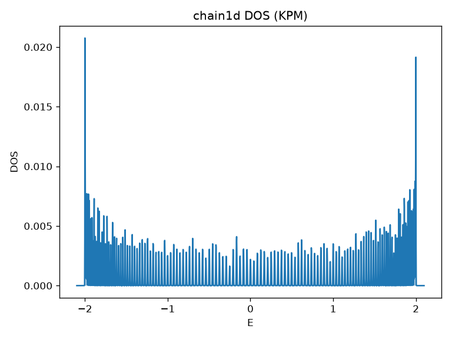
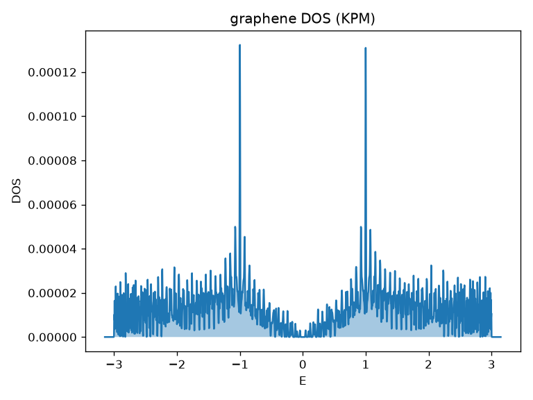
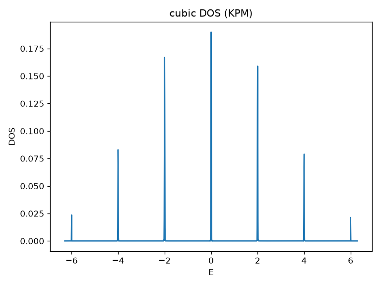
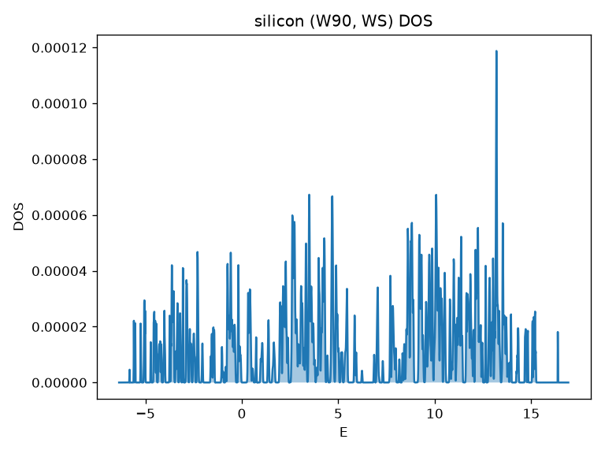
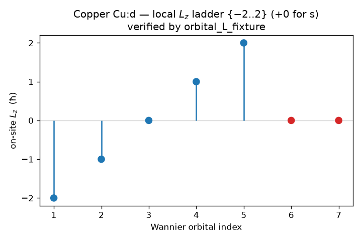
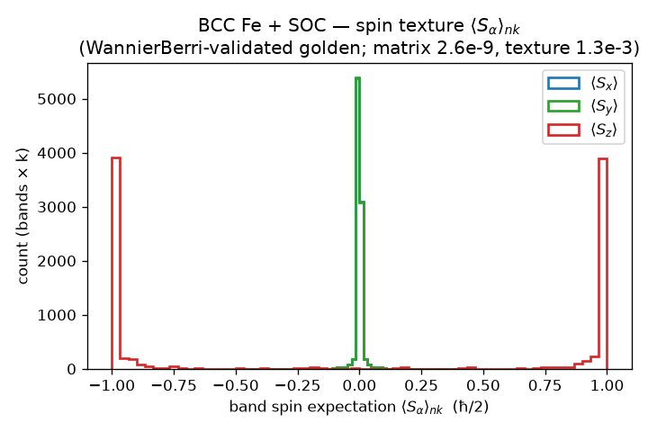

# Runnable examples: see wannier2sparse in action

A finite crystal has a discrete set of levels, yet we routinely draw a smooth
density of states and read the physics off its peaks and gaps. Where does the
smooth curve come from, and is it faithful to the model we started from?

Each example here answers that for a canonical tight-binding model. It builds the
model as a Wannier90 `_hr.dat`, expands it into a supercell with `wannier2sparse`,
and reconstructs the density of states $\rho(E)$ from the resulting sparse CSR by
the Kernel Polynomial Method (KPM). KPM needs only sparse matrix-vector products,
the same operation a LinQT transport calculation runs, so the curve scales to
large supercells without dense diagonalization. The lesson the gallery teaches:
the real-space operator $O_{ij}(R)$ in the CSR is the whole model, and the
supercell size is the resolution dial on its spectrum.

## Running an example

```bash
cd examples
bash run.sh graphene 80        # model + supercell size N
# -> models/tb/graphene/graphene_dos.png
```

The tight-binding models are `chain1d`, `graphene`, `cubic`, `haldane`. `N` sets
the supercell ($N\times1\times1$ in 1D, $N\times N\times1$ in 2D, and about
$N^{1/3}$ per side in 3D). Building the tool is covered once in the top-level
[README](../README.md); set `W2SP_BIN=/path/to/wannier2sparse` if it is not at
`../build/wannier2sparse`.

The recommended way to drive a run is the **input-file workflow**: record the
options in an editable `key = value` file, then execute it. It is self-documenting
and reproducible (the older positional CLI gives byte-identical output):

```bash
wannier2sparse --create graphene.inp                      # 1. write a template
wannier2sparse --write label=graphene    -inp graphene.inp    # 2. populate it
wannier2sparse --write supercell 80 80 1 -inp graphene.inp
wannier2sparse --run graphene.inp                         # 3. run -> graphene.HAM.CSR + graphene.w2sp.out
```

The exact, supercell-free reference for any reconstructed `_hr.dat` (bands, DOS,
conductivity, spin Hall) is [`tools/hr_exactdiag.py`](../tools/hr_exactdiag.py).

## Tutorials

Each model is a short, self-contained tutorial; they build on one another:

| # | Tutorial | Teaches |
|---|---|---|
| 1 | [`01_chain1d`](01_chain1d/) | the full pipeline: primitive $O_{ij}(R)$ to supercell CSR to KPM DOS; the input-file CLI; supercell size as the resolution dial |
| 2 | [`02_graphene`](02_graphene/) | the exact-diagonalization cross-check (`hr_exactdiag`) as the oracle for the stochastic KPM |
| 3 | [`03_cubic`](03_cubic/) | linear scaling and the $N^3$ resolution trade in 3D; `--mode sparse` vs `--mode bundle` |
| 4 | [`04_haldane`](04_haldane/) | complex hoppings and a gap; how $H(R)$ carries the ingredients of topology |
| 9 | [`example_9_SHC_in_PdSe2`](example_9_SHC_in_PdSe2/) | a real SOC Wannier model end to end: operators, the spin current, and the intrinsic spin Hall conductivity |

## The physics each model shows

Every model has a closed-form spectrum, so the figure is checked against an
analytic prediction, not against itself ($t=-1$ throughout):

| Model | What the DOS shows | Analytic limit |
|---|---|---|
| `chain1d` | a 1D band with van Hove divergences at the edges | $E = 2t\cos k$, support $[-2,2]$ |
| `graphene` | a Dirac dip to zero at $E=0$, van Hove peaks at $\pm\lvert t\rvert$ | edges $\pm 3$, peaks $\pm 1$ |
| `cubic` | a 3D band with a van Hove kink near the centre | $E = 2t(\cos k_x+\cos k_y+\cos k_z)$, edges $\pm 6$ |
| `haldane` | a gap around $E=0$, in contrast to graphene's gapless dip | $E_g \approx 3\sqrt{3}\,t_2 \approx 0.78$ for $t_2=0.15$ |

These are written by `gen_models.py`; edit it to change $t$, $t_2$, the flux
$\phi$, or the sublattice mass, and re-run. The figures below come from
`w2s_dos.py` (KPM, Jackson kernel, fixed seed) and are checked by `validate.py`,
which asserts the support, gap, dip, or metallic class against the table above.



FIG. 1. Density of states $\rho(E)$ of the 1D tight-binding chain. The
characteristic 1D inverse-square-root van Hove divergences sit at the band edges
$E = \pm 2\lvert t\rvert$ and the support is $[-2,2]$ for $t=-1$. KPM
reconstruction with $M = 2048$ Chebyshev moments, $R = 20$ stochastic vectors,
Jackson kernel, on a $400\times1\times1$ supercell.



FIG. 2. Density of states of honeycomb graphene. $\rho(E)$ vanishes at the Dirac
point $E=0$, with van Hove peaks at $E=\pm\lvert t\rvert$ and band edges
$\pm 3\lvert t\rvert$. Same KPM settings as FIG. 1 on an $80\times80\times1$
supercell.



FIG. 3. Density of states of the simple-cubic band over $[-6,6]$,
$E = 2t(\cos k_x+\cos k_y+\cos k_z)$, with a van Hove feature near the centre.
The supercell is a modest $18\times18\times18$, so the KPM density is coarser than
the 2D panels. Same KPM settings as FIG. 1.


FIG. 4. Density of states of the Haldane model (graphene plus a complex
next-nearest-neighbour hopping). The complex hopping opens a gap
$E_g \approx 3\sqrt{3}\,t_2 \approx 0.78$ for $t_2 = 0.15$, in contrast to
graphene's gapless Dirac dip in FIG. 2. Same KPM settings as FIG. 1 on an
$80\times80\times1$ supercell.

## Plotting any CSR yourself

`w2s_dos.py` works on any `*.HAM.CSR`, or any operator CSR, the tool writes:

```bash
python3 w2s_dos.py graphene/graphene.HAM.CSR --out g.png
python3 w2s_dos.py chain1d/chain1d.HAM.CSR --mode spectrum --out band.png   # small cells
```

`--mode dos` (the default) gives the KPM spectral density, with `--moments` and
`--vectors` controlling resolution and smoothness. `--mode spectrum` gives the
exact eigenvalues by dense diagonalization, for small supercells only; for the 1D
chain the sorted spectrum traces the band $E(k)$ directly.

## Why the spectrum, and not $E(k)$

`wannier2sparse` exports the real-space supercell Hamiltonian, with every $H(R)$
folded into one matrix under periodic boundary conditions. The quantity that comes
straight out of the CSR is therefore the spectrum, or its density, not the band
structure $E(k)$. That is exactly what a KPM transport calculation consumes. A
full $E(k)$ path would need the per-$R$ blocks before folding; for the 1D chain,
`--mode spectrum` already recovers the dispersion because its sorted eigenvalues
are the band sampled at the supercell's allowed $k$-points.

## Shipping the model, not its spectrum: the provenance bundle

That last paragraph left a thread hanging: a full $E(k)$ needs the per-$R$ blocks
before folding, and the CSR no longer has them. The bundle is exactly those blocks.
Instead of expanding, `--mode bundle` writes the primitive operator $O_{ij}(R)$
unexpanded, so a consumer holds the model itself and can form the Bloch
Hamiltonian at any $\mathbf{k}$,

$$ H(\mathbf{k}) = \sum_{\mathbf{R}} e^{i\mathbf{k}\cdot\mathbf{R}}\, H(\mathbf{R}), $$

then pick its own supercell later. The lesson of this gallery, that $O_{ij}(R)$ is
the whole model, becomes literal: the bundle ships that object and nothing folded.

```bash
$W2SP_BIN graphene 1 1 1 VX SZ --mode bundle -o out
```

```
out/graphene.w2sp/
  manifest.json
  operators/HAM.hr.dat   VX.hr.dat   SZ.hr.dat
```

The supercell dimensions are accepted but ignored, since nothing is expanded. Each
`operators/<NAME>.hr.dat` is the same `_hr.dat` shape the tool reads, so it
re-enters any pipeline through `--op-file`. The numbers are already
`ndegen`-normalized and written with `ndegen = 1`: the trap to avoid is dividing by
the Wigner-Seitz degeneracy a second time, and the manifest's `normalization` block
records that it was applied once already.

What the CSR discards, the manifest keeps: the lattice and reciprocal vectors, the
Wannier sites with their spin labels, the crystal symmetry operations, and the DFT
and Wannier conditions behind the model. The last two are read from a Quantum
ESPRESSO `data-file-schema.xml` and a Wannier90 `.win`, named in a small `.w2s`
input file that drives the whole run. Scaffold it with `--create`, add the
provenance paths, then run it:

```bash
$W2SP_BIN --create "graphene 1 1 1 VX SZ --mode bundle" -inp graphene   # writes graphene.w2s
# add provenance paths to graphene.w2s:
#   "provenance": { "qe_xml": "scf.save/data-file-schema.xml", "win": "graphene.win" }
$W2SP_BIN graphene.w2s
```

This produces a bundle byte-identical to the direct command above. If a provenance
file is absent, its manifest block is `null` and `provenance_complete` is `false`,
so the bundle is always well-formed; supply both and a consumer can rebuild not
only $H(\mathbf{k})$ but the physical context it lives in. That the unexpanded
operator plus the manifest is sufficient is checked in the repo: the
`bundle_hk_rebuild` test reconstructs $H(\mathbf{k})$ from a written bundle and
recovers the graphene Dirac touching at $E=0$.

```bash
ctest --test-dir ../build -R bundle_hk_rebuild --output-on-failure          # PASS
```

## One input file, and a record of what the run did

The same `.w2s` that drives a bundle also drives a supercell CSR run, so a whole
calculation lives in one traceable file instead of a long command line. The
`"mode"` key picks the output; everything else reads the same. Scaffold the file
from a short command with `--create`, edit it, then run it:

```bash
$W2SP_BIN --create "graphene 80 80 1 VX SZ -o out" -inp graphene   # writes graphene.w2s
$W2SP_BIN graphene.w2s
```

```json
{ "label": "graphene", "mode": "sparse", "output_dir": "out",
  "supercell": [80, 80, 1], "operators": ["VX", "SZ"] }
```

This writes the same `out/graphene.HAM.CSR` and operator files a direct
`graphene 80 80 1 VX SZ` would. Each run also leaves a log at `out/graphene.run.log`
and ends with a summary of where the time and memory went, so a long expansion is
never a silent black box:

```
[INFO ] ==== run summary ====
[INFO ] total wall time: 1.204 s
[INFO ]   load model            0.012 s
[INFO ]   write HAM             1.100 s
[INFO ]   write operators       0.090 s
[INFO ] peak memory: 142.5 MiB
[INFO ] warnings: 0   errors: 0
```

Warnings and errors are always reported and counted (use `--quiet` to keep only
those on the console, `--verbose` for the full trace), and any error makes the run
exit non-zero, so a broken run fails loudly rather than producing half a dataset.

The same run also writes a machine-readable receipt at `out/graphene.out`: the
resolved invocation, the per-step timings and peak memory above, and an `outputs`
ledger naming every operator written together with the input files (`_hr.dat`,
`.uc`, `.xyz`, …) that produced it — so each artifact carries its own provenance.

## A real Wannier90 model: silicon, with the Wigner-Seitz minimum image

Unlike the ideal models above, silicon ($sp^3$, SOC-free) is a real DFT-derived
Wannier model, with genuine Wigner-Seitz degeneracies and a `_wsvec.dat`. The tool
auto-detects the minimum-image correction from the presence of
`<seed>_wsvec.dat`, with no flag, which is the real workflow.

```bash
# the fixture lives outside the repo (regenerate it, see below); point the tool at it
cd models/wannier/silicon
$W2SP_BIN silicon 8 8 8                          # WS auto-on (silicon_wsvec.dat present)
python3 /path/to/examples/w2s_dos.py silicon.HAM.CSR --out silicon_dos.png
```



FIG. 5. Density of states of the real Wannier90 silicon model with the
Wigner-Seitz minimum image applied. The support $[-5.83, 16.40]\ \mathrm{eV}$ lies
inside the DFT eigenvalue window $[-5.82, 19.44]\ \mathrm{eV}$ and shows a clean
gap, consistent with silicon being an insulator; a wrong WS treatment smears or
closes that gap. KPM as in FIG. 1, on an $8\times8\times8$ supercell.

Two things make this case real rather than ideal. The Wannier $H(R)$ reaches out
to $\lvert R\rvert = 3$, so the minimum-image guard requires $N \ge 2\,\mathrm{range}+1 = 7$
per axis; smaller cells would alias distinct bonds and corrupt the operator, and
the tool refuses them (ideal models have range 1, hence the small $N$ above). The
inputs are not committed (each `_hr.dat` and `_wsvec.dat` is about 0.3 MB; the
repo keeps only the plot). Regenerate the fixture with
`../../../test/fixtures/gen_fixture.sh` (see `../test/fixtures/README.md`). A DOS
run needs only `silicon_hr.dat`, `silicon_wsvec.dat`, and a `silicon.uc` holding
the three lattice vectors from `silicon.win`; a velocity operator would also need
`silicon.xyz`, which is not the same as Wannier90's `_centres.xyz` (build one as a
`num_wann` header followed by the first `num_wann` `label x y z` rows of
`_centres.xyz`).

## Orbital angular momentum: copper, with `--orbital-L`

Copper (a complete $\ell=2$ shell `Cu:d` plus two interstitial $s$) is the
orbital-$L$ example. Correctness is anchored to the repo's own test, not
re-derived here:

```bash
W2SP_ORBITAL_FIXTURE=/path/to/copper/copper \
  ctest --test-dir ../../../build -R orbital_L_fixture --output-on-failure   # PASS
$W2SP_BIN copper 7 7 7 --orbital-L          # writes copper.{LX,LY,LZ}.CSR (range 3 -> N>=7)
```



FIG. 6. On-site local $L_z$ eigenvalues for copper's seven Wannier orbitals. A
complete shell carries the integer ladder $\{-2,-1,0,1,2\}$ for the $d$ states and
$0$ for each $s$, which is exactly what the `orbital_L_fixture` test verifies. The
operator the tool exports, the projected supercell $L_W(R)$ in `copper.LZ.CSR`, is
Hermitian but not integer-valued, because Wannier functions are not pure spherical
harmonics; the integer ladder lives on the local block, not the projected one (see
[docs/conventions.md](../docs/conventions.md) §5 and [docs/operators.md](../docs/operators.md) §2.4).

## Exact spin and spin-orbit: iron, with `--exact-spin`

BCC iron with SOC (`spinors`) is the spin example, the only fixture with a `.spn`.
Spin-operator correctness is carried by tests, not by a figure:

```bash
ctest --test-dir ../../../build -R gauge_spin --output-on-failure              # PASS (self-contained)
# with the Fe fixture + committed goldens present, the independent cross-checks:
W2SP_SPIN_FIXTURE=/path/to/Fe/Fe \
  ctest --test-dir ../../../build -R 'wberri_(matrix|texture)_crosscheck'      # PASS
$W2SP_BIN Fe 13 13 13 --exact-spin           # writes Fe.{SXexact,SYexact,SZexact}.CSR
```



FIG. 7. Band spin texture $\langle S_\alpha\rangle_{nk}$ (units $\hbar/2$) of BCC
iron with spin-orbit coupling, from the WannierBerri-validated golden
`test/golden/Fe_S_texture.ref` (matrix agreement $2.6\times10^{-9}$, texture
$1.3\times10^{-3}$; see [docs/conventions.md](../docs/conventions.md) §7). There
is no DOS panel for iron: its $H(R)$ reaches $\lvert R\rvert = 6$, so the guard
requires $N \ge 13$, and an 18-Wannier range-6 supercell at $13^3$ produces a CSR
above 1 GB, impractical for a laptop KPM demo. The heavy Fe fixture (about 80 MB)
is regenerated by `../../../test/fixtures/gen_fixture.sh`, never committed.

## References and links

- wannier2sparse source and documentation: https://github.com/adamecius/wannier2sparse
- Operator and gauge conventions: [docs/conventions.md](../docs/conventions.md) and [docs/operators.md](../docs/operators.md).
- Kernel Polynomial Method: A. Weisse, G. Wellein, A. Alvermann, H. Fehske,
  Rev. Mod. Phys. 78, 275 (2006), arXiv:cond-mat/0504627.
- Transport methodology: Z. Fan, J. H. Garcia, A. W. Cummings et al., Linear
  scaling quantum transport methodologies, Phys. Rep. 903, 1 (2021),
  arXiv:1811.07387.
- The full fixture catalogue and the WannierBerri cross-validation: [../test/fixtures/README.md](../test/fixtures/README.md).
</content>
