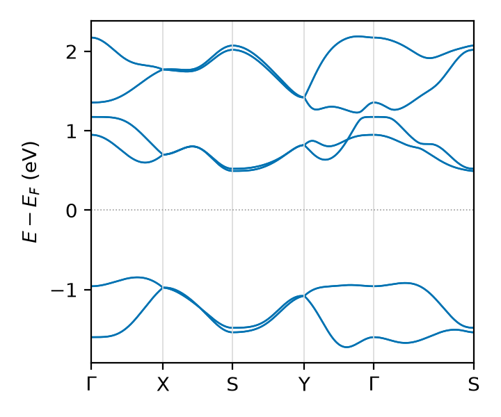

# Tutorial 9: a spin current with no charge current, in a real SOC material

Send an electric field through monolayer PdSe$_2$ and no charge Hall current
flows, the crystal has inversion symmetry. Yet a transverse flow of *spin* is
allowed, and spin-orbit coupling switches it on. How large is it, where in energy
does it live, and how faithfully can we read it off a tight-binding-sized model of
a first-principles material?

We compute the intrinsic spin Hall conductivity $\sigma^{z}_{xy}$ of PdSe$_2$ from
a Wannier model, as the response of the spin current $J^{z}_{x}$ to a field along
$y$. The one lesson that survives into every later use: a transport coefficient is
only ever as good as the *operators* you build, and for an interband quantity like
$\sigma^{z}_{xy}$ the velocity operator must carry the Berry connection, not just
the gradient of the Hamiltonian.

## The physics

A Wannier model is a set of real-space operators $O_{ij}(\mathbf{R})$ between
Wannier function $i$ in the home cell and $j$ in cell $\mathbf{R}$. Every momentum
quantity comes from the same forward transform (see `docs/conventions.md`):

$$ O(\mathbf{k}) = \sum_{\mathbf{R}} e^{+i 2\pi \mathbf{k}\cdot\mathbf{R}}\,
   \frac{O(\mathbf{R})}{n_{\mathrm{deg}}(\mathbf{R})}. $$

We need three operators: the Hamiltonian $H$, the velocity $v_a = \partial H /
\partial k_a$, and the spin $S_z$ (Pauli, units $\hbar/2$). From them the **spin
current** is the symmetrized product

$$ J^{z}_{x} = \tfrac{1}{2}\{\,v_x,\,S_z\,\}, $$

and the intrinsic (Fermi-sea) spin Hall conductivity is the spin-Berry-curvature
sum over occupied states,

$$ \sigma^{z}_{xy}(E_F) = \frac{e}{\hbar}\!\!\sum_{\mathbf{k}}\sum_{n\ \mathrm{occ}}
   \sum_{m\neq n} \frac{2\,\mathrm{Im}\big[\langle n|J^{z}_{x}|m\rangle\langle m|v_y|n\rangle\big]}
   {(E_n-E_m)^2}. $$

The conceptual result this tutorial turns on: that interband sum is sensitive to
the **off-diagonal velocity matrix elements**, and those are wrong unless the
velocity includes the Berry connection $A_a(\mathbf{R})=\langle 0i|r_a|\mathbf{R}j\rangle$
(the inter-Wannier dipoles). The bare $v_a = i(\mathbf{R}\!\cdot\!\mathrm{lat})_a
H(\mathbf{R})$ gets the bands right but the spin Hall wrong.



FIG. 1. Wannier band structure of monolayer PdSe$_2$ (12 spinor Wannier
functions, relativistic PBE + SOC) along $\Gamma$-X-S-Y-$\Gamma$-S, $E$ relative
to $E_F=-1.3162$ eV. A clean gap surrounds $E_F$; the intrinsic $\sigma^{z}_{xy}$
peaks near the conduction-band near-degeneracy at $E-E_F\approx 1.2$ eV.
Reconstructed from `pdse2_proj_hr.dat` by `tools/hr_exactdiag.py bands`.

## Pre-run: from Quantum ESPRESSO to the operators

Nothing bulky is shipped (repo policy): this example commits only the small text
inputs and regenerates everything else with `get_inputs.sh`. The chain is

```bash
# (committed: qe/scf.in qe/nscf.in qe/bands.in  w90/pdse2_proj.win  w90/pw2wan*.in)
bash get_inputs.sh 50          # runs QE -> Wannier90 -> wannier2sparse (N=50 cell)
```

Step by step, and the file each step emits:

1. **SCF + NSCF** (`pw.x`, noncollinear + `lspinorb`, full uniform $4\times4\times1$
   grid). Needs the fully-relativistic Pd, Se PAW pseudopotentials (~9 MB, **not
   committed**, fetch per `get_inputs.sh`).
2. **`wannier90.x -pp`** then **`pw2wannier90.x`** twice: the first writes the
   overlaps/projections/eigenvalues (`.mmn`, `.amn`, `.eig`), the second
   (`pw2wan_spn.in`) writes the spin matrices (`.spn`). `.mmn` (32 MB) and `.spn`
   (3.5 MB) are the large files we deliberately do not ship.
3. **`wannier90.x`** with `write_hr`, `write_xyz`, `write_u_matrices` (and
   `write_rmn` for the covariant velocity) produces `pdse2_proj_hr.dat` (the
   Hamiltonian), `.xyz` (Wannier centres), `_u.mat`, and optionally `_r.dat` (the
   position/Berry-connection matrix).

Which operator needs which file is tabulated in `docs/operators.md`; the short
version is: $H$ and the geometric velocity need only `_hr.dat` + `.xyz` + `.uc`;
exact spin needs `.spn` + `_u.mat`; the covariant velocity needs `_r.dat`.

## Building the operators and the spin current

`wannier2sparse` expands the primitive model into a finite supercell CSR and, in
the same call, builds the velocity, the exact spin, and the spin current:

```bash
wannier2sparse pdse2_proj 50 50 1 VX VY --exact-spin --spin-current X Z -o out
# -> out/pdse2_proj.{HAM,VX,VY,SZexact,JXSZ}.CSR
```

The spin current is the lesson of §"physics" made operational. For the diagonal
$\sigma_z$ the anticommutator is local, but for off-diagonal $\sigma_{x,y}$ it
mixes orbitals, so `--spin-current` forms the true matrix anticommutator
$\tfrac12(V S + S V)$ after expansion rather than an element-wise product. A
**tight-binding** user who already has the operators as `_hr.dat` (including a
`*_spin_hr.dat`) skips DFT entirely and ingests them:

```bash
wannier2sparse mymodel 50 50 1 --op-file SZ mymodel_Sz_hr.dat \
                               --op-file JXSZ mymodel_JXSZ_hr.dat -o out
```

## The Kubo conductivity, two ways

The CSR operators feed the linear-scaling Kubo-Bastin spin Hall in lsquant (KPM):
intrinsic and extrinsic separate as the Fermi-**sea** and Fermi-**surface** parts,

$$ \sigma^{z}_{xy} = \sigma^{\mathrm{sea}}_{xy}\;(\text{intrinsic, Berry})
   + \sigma^{\mathrm{surf}}_{xy}\;(\text{extrinsic, Fermi surface}). $$

For a clean crystal the surface part is broadening-limited and dominates the raw
Kubo-Bastin, so the **intrinsic** plateau is the sea part; in the gap the sea part
is the whole answer and the surface part vanishes.

## The exact-diagonalization reference

Because KPM is stochastic and linear-scaling, we check it against an exact route on
the *same* operators. `tools/hr_exactdiag.py` reconstructs $H(\mathbf{k})$ and
$O(\mathbf{k})$ and diagonalizes densely on a k-mesh, with no supercell:

```bash
../../tools/hr_exactdiag.py bands pdse2_proj --ef -1.3162   # FIG. 1
../../tools/hr_exactdiag.py dos   pdse2_proj                # DOS, integral = num_wann
../../tools/hr_exactdiag.py shc   pdse2_proj \
        --jop pdse2_proj_JXSZ_hr.dat --vop pdse2_proj_vy_hr.dat   # intrinsic sigma^z_xy
```

This is the framework that turns any reconstructed `_hr.dat` operator set into
bands, DOS, and Kubo quantities, and it is how the "exact" curve in the spin-Hall
comparison is produced. The takeaway repeats: feed it the *bare* velocity and the
intrinsic $\sigma^{z}_{xy}$ comes out anticorrelated with the truth; feed it the
**covariant** velocity (Berry connection) and it matches. PdSe$_2$ itself is a
trivial insulator ($Z_2=0$), so the $\sim 1\,e^2/h$ peak near $1.2$ eV is a large
*non-topological* spin-Berry-curvature feature, not a quantized plateau.
